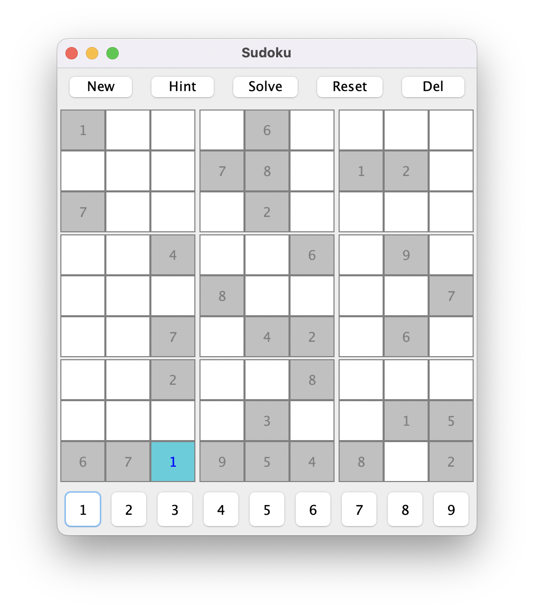

# Sudoku

Simple implementation with CUI and GUI.

1. repl mode

```
% java Sudoku repl
-----+-----+-----+
. . 3 . 5 . . 8 9
. . . . 8 9 1 . .
. . . 1 . . . 5 .
. . 4 . . 5 . 9 7
. . . . . 8 . 1 .
. . 7 9 . 4 3 6 .
. . 1 5 . . 9 . .
. . 5 . . 7 2 . 1
9 . . . . . . 4 .
-----+-----+-----+
> set 0 0 1
Set 0 0 1 returns true
-----+-----+-----+
1 . 3 . 5 . . 8 9
. . . . 8 9 1 . .
. . . 1 . . . 5 .
. . 4 . . 5 . 9 7
. . . . . 8 . 1 .
. . 7 9 . 4 3 6 .
. . 1 5 . . 9 . .
. . 5 . . 7 2 . 1
9 . . . . . . 4 .
-----+-----+-----+
> help
Available commands:
 1. new
 2. reset
 3. solve
 4. hint <row> <col>
 5. set <row> <col> <value>
 6. hint <row> <col>
 7. undo
 8. quit
```

2. swing mode



# Usage:

```sh
$ java Sudoku [repl | swing]
```

- repl: run in cui repl mode
- swing: run in gui swing mode
